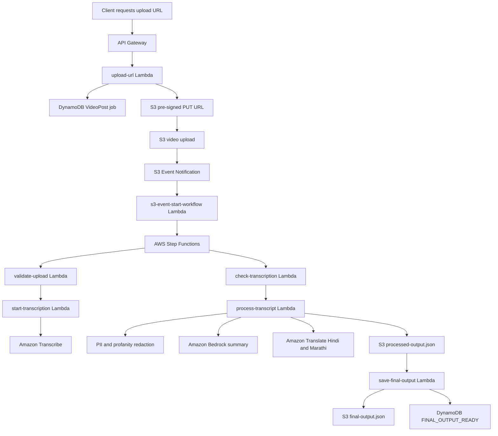

Copy-paste this as your `README.md`:

# AWS Video Redaction Pipeline

A serverless AWS pipeline that processes uploaded videos into transcripts, redacted transcripts, Bedrock-generated summaries, and Hindi/Marathi translations. The system uses AWS Lambda for processing stages, AWS Step Functions for orchestration, Amazon S3 for media storage, Amazon Transcribe for speech-to-text, Amazon Translate for multilingual transcript output, Amazon Bedrock for summarization, and DynamoDB for job tracking.

> Note: The current pipeline is configured for English audio transcription. It generates an English transcript, redacts sensitive content, summarizes the redacted transcript with Amazon Bedrock, and translates the redacted transcript into Hindi and Marathi.

---

## Architecture



---

## What this project demonstrates

* Secure video ingestion using S3 pre-signed URLs
* Event-driven processing using S3 events and AWS Step Functions
* A 5-stage Step Functions workflow with retry and failure handling
* Job status tracking using DynamoDB
* English speech-to-text using Amazon Transcribe
* PII and profanity redaction before summarization
* Transcript summarization using Amazon Bedrock
* Hindi and Marathi transcript translations using Amazon Translate
* Final structured JSON output stored in S3
* Archived-media backfill workflow for previously uploaded S3 media
* Seeded redaction validation suite with 120 test cases

---

## Tech stack

| Area          | Technology         |
| ------------- | ------------------ |
| Orchestration | AWS Step Functions |
| Compute       | AWS Lambda         |
| API           | Amazon API Gateway |
| Storage       | Amazon S3          |
| Job tracking  | Amazon DynamoDB    |
| Transcription | Amazon Transcribe  |
| Summarization | Amazon Bedrock     |
| Translation   | Amazon Translate   |
| Logging       | Amazon CloudWatch  |
| Runtime       | Node.js 22.x       |

---

## Repository structure

```text
.
├── architecture/
│   ├── step-functions-definition.json
│   ├── lambda-inline-policy.json
│   └── s3-event-starter-policy.json
├── lambdas/
│   ├── upload-url/
│   ├── validate-upload/
│   ├── start-transcription/
│   ├── check-transcription/
│   ├── process-transcript/
│   ├── save-final-output/
│   ├── demo-read-api/
│   ├── s3-event-start-workflow/
│   └── mark-failed/
├── scripts/
│   ├── backfill-archived-media.mjs
│   └── package-lambdas.sh
├── shared/
│   └── redaction.mjs
├── tests/
│   └── redaction-validation.test.mjs
├── sample-outputs/
│   └── final-output.sample.json
├── .env.example
├── .gitignore
├── package.json
└── README.md
```

---

## Processing flow

1. A client requests a pre-signed upload URL from `POST /upload-url`.
2. The video is uploaded directly to S3.
3. An S3 event notification triggers `s3-event-start-workflow`.
4. The starter Lambda creates or updates the DynamoDB job and starts Step Functions.
5. Step Functions validates the upload.
6. Amazon Transcribe generates the transcript.
7. The workflow checks transcription status until transcription is complete.
8. The transcript is redacted before summarization.
9. Amazon Bedrock summarizes the redacted transcript.
10. Amazon Translate creates Hindi and Marathi translations.
11. Final output is written to S3.
12. DynamoDB is updated with the final job status and output locations.

---

## Step Functions workflow

The workflow definition is available at:

```text
architecture/step-functions-definition.json
```

The workflow contains these main stages:

1. `ValidateUpload`
2. `StartTranscription`
3. `CheckTranscription`
4. `ProcessTranscript`
5. `SaveFinalOutput`

If any stage fails after retries, the workflow routes to `MarkFailed`, which updates DynamoDB with:

```text
WORKFLOW_FAILED
failedStage
failureDetails
failedAt
```

This makes failures easier to debug and prevents silent workflow crashes.

---

## AWS resources

### DynamoDB table

Create a DynamoDB table:

```text
Table name: VideoPost
Partition key: videoId
Partition key type: String
```

The table stores job metadata, processing status, S3 output locations, workflow execution details, and failure information.

---

### S3 layout

Use one private media bucket with prefixes like:

```text
s3://YOUR_BUCKET/video-transcription/uploads/{videoId}/video.mp4
s3://YOUR_BUCKET/video-transcription/transcripts/{videoId}/...
s3://YOUR_BUCKET/video-transcription/results/{videoId}/processed-output.json
s3://YOUR_BUCKET/video-transcription/results/{videoId}/final-output.json
s3://YOUR_BUCKET/video-transcription/archive/...
```

---

### Lambda environment variables

Set only the variables needed by each Lambda. Common variables include:

```text
TABLE_NAME=VideoPost
BUCKET_NAME=your-bucket-name
UPLOAD_PREFIX=video-transcription/uploads/
RESULT_PREFIX=video-transcription/results/
TRANSCRIBE_OUTPUT_PREFIX=video-transcription/transcripts/
TRANSCRIBE_LANGUAGE_CODE=en-US
BEDROCK_MODEL_ID=amazon.nova-lite-v1:0
STATE_MACHINE_ARN=arn:aws:states:us-east-1:ACCOUNT_ID:stateMachine:video-processing-workflow
DEMO_VIDEO_IDS=video-id-1,video-id-2
```

Use the Bedrock model ID that is enabled in your AWS account and region. `amazon.nova-lite-v1:0` is included as an example default.

---

## IAM permissions

Use the policy files under `architecture/` as starting points.

```text
architecture/lambda-inline-policy.json
architecture/s3-event-starter-policy.json
```

Before applying them, replace:

```text
REGION
ACCOUNT_ID
BUCKET_NAME
```

The processing Lambdas need access to:

* DynamoDB read/write for the `VideoPost` table
* S3 read/write for the video processing prefixes
* Amazon Transcribe start and read operations
* Amazon Translate text translation
* Amazon Bedrock model invocation
* CloudWatch logging

The S3 event starter Lambda also needs:

```text
states:StartExecution
```

The Step Functions execution role needs permission to invoke the Lambda functions used in the workflow.

---

## API routes

Suggested HTTP API routes:

```text
POST /upload-url       -> upload-url Lambda
GET  /videos           -> demo-read-api Lambda
GET  /final/{videoId}  -> demo-read-api Lambda
```

The demo API only returns videos listed in the `DEMO_VIDEO_IDS` environment variable. This prevents every processed video from appearing publicly.

---

## Event-driven upload setup

Configure an S3 event notification:

```text
Bucket: your media bucket
Event type: All object create events
Prefix: video-transcription/uploads/
Destination: s3-event-start-workflow Lambda
```

After this is configured, new uploads automatically start the Step Functions workflow.

---

## Local setup

Install dependencies:

```bash
npm install
```

Run the redaction validation suite:

```bash
npm run test:redaction
```

Expected output:

```text
Redaction validation passed: 120/120 seeded cases
```

---

## Packaging Lambda functions

To create deployable zip files for the Lambda folders:

```bash
npm install
./scripts/package-lambdas.sh
```

The generated zip files will be placed under:

```text
dist/lambdas/
```

Upload each zip to its matching Lambda function in the AWS console, or deploy using the AWS CLI.

---

## Deploying Step Functions

Use:

```text
architecture/step-functions-definition.json
```

Before creating the state machine, replace the placeholder Lambda ARNs:

```text
REPLACE_WITH_VALIDATE_UPLOAD_LAMBDA_ARN
REPLACE_WITH_START_TRANSCRIPTION_LAMBDA_ARN
REPLACE_WITH_CHECK_TRANSCRIPTION_LAMBDA_ARN
REPLACE_WITH_PROCESS_TRANSCRIPT_LAMBDA_ARN
REPLACE_WITH_SAVE_FINAL_OUTPUT_LAMBDA_ARN
REPLACE_WITH_MARK_FAILED_LAMBDA_ARN
```

Then create the Step Functions state machine using the updated definition.

---

## Backfill archived media

The backfill script scans an S3 prefix, creates DynamoDB job records, and starts Step Functions executions.

Dry run one object:

```bash
STATE_MACHINE_ARN="arn:aws:states:us-east-1:ACCOUNT_ID:stateMachine:video-processing-workflow" \
BUCKET_NAME="your-bucket-name" \
node scripts/backfill-archived-media.mjs \
  --prefix=video-transcription/archive/ \
  --limit=1 \
  --dry-run
```

Run one object:

```bash
STATE_MACHINE_ARN="arn:aws:states:us-east-1:ACCOUNT_ID:stateMachine:video-processing-workflow" \
BUCKET_NAME="your-bucket-name" \
node scripts/backfill-archived-media.mjs \
  --prefix=video-transcription/archive/ \
  --limit=1 \
  --delay-ms=2000
```

For larger backfills, increase `--limit` slowly and keep `--delay-ms` enabled to avoid overwhelming downstream services.

---

## Sample output

A final output object contains:

```json
{
  "videoId": "example-video-id",
  "status": "FINAL_OUTPUT_READY",
  "input": {
    "filename": "sample.mp4",
    "contentType": "video/mp4",
    "bucketName": "example-bucket",
    "originalVideoS3Key": "video-transcription/uploads/example-video-id/sample.mp4"
  },
  "transcript": {
    "original": "Original transcript text",
    "redacted": "Redacted transcript text"
  },
  "summary": "Bedrock-generated summary",
  "translations": {
    "en": "Redacted English transcript",
    "hi": "Hindi translation",
    "mr": "Marathi translation"
  },
  "redactionLog": [
    {
      "type": "EMAIL",
      "count": 1
    }
  ],
  "services": {
    "transcription": "Amazon Transcribe",
    "summarization": "Amazon Bedrock",
    "translation": "Amazon Translate",
    "storage": "Amazon S3",
    "jobTracking": "Amazon DynamoDB",
    "orchestration": "AWS Step Functions"
  }
}
```

---

## Security notes

* Do not commit `.env` files.
* Do not commit AWS credentials.
* Do not commit `.pem` files.
* Do not commit pre-signed URLs.
* Keep the media bucket private.
* Use `DEMO_VIDEO_IDS` to control which processed videos appear publicly.
* Rotate any API key or credential that was exposed during development.
* Use IAM policies with only the permissions required by each Lambda.

---

## Cost notes

This project uses several AWS services that may incur charges, including S3, Transcribe, Translate, Step Functions, Lambda, DynamoDB, Bedrock, and CloudWatch.

Before running larger backfills:

* Set an AWS budget alert.
* Start with `--dry-run`.
* Test with `--limit=1`.
* Increase limits gradually.
* Use throttling with `--delay-ms`.
* Clean up temporary S3 objects after testing.

---

## Future improvements

* Add multi-language audio detection before transcription
* Add stronger placeholder protection during translation
* Add CloudWatch dashboard metrics
* Add CI workflow for redaction tests
* Add deployment automation with AWS SAM, CDK, or Terraform
* Add more structured failure analytics for large backfills

---

## Project status

Core workflow is implemented with Bedrock-based summarization support. The repository includes Lambda source code, workflow definitions, IAM policy templates, backfill scripts, sample output, and redaction validation tests.
