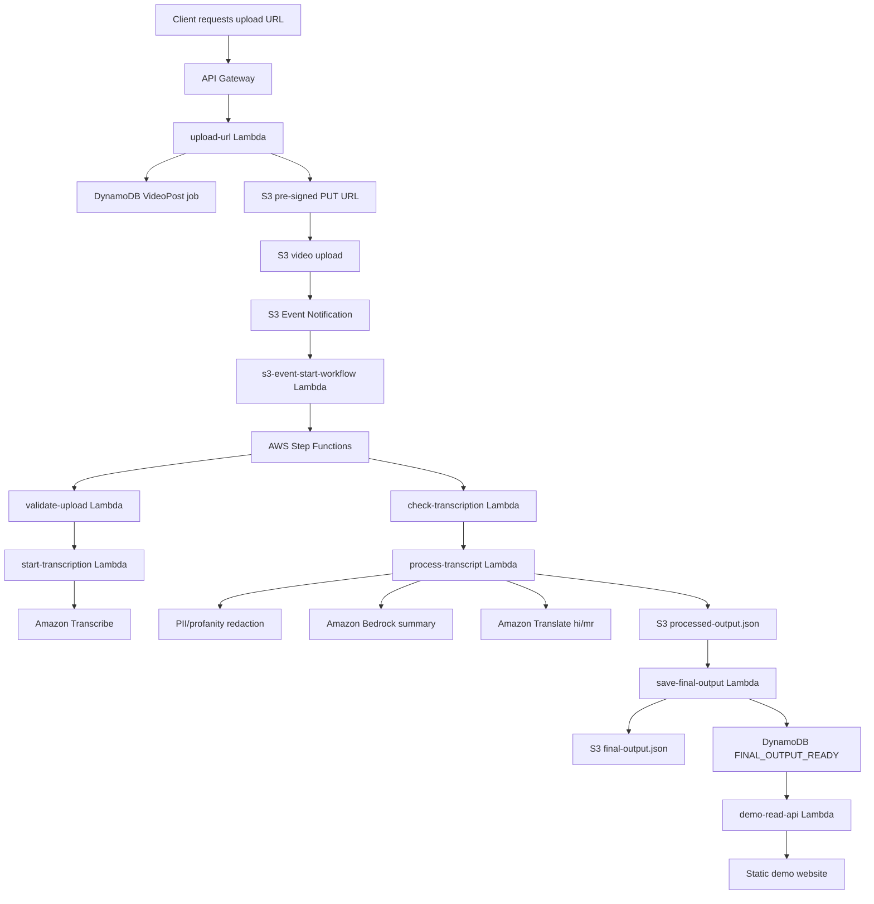

# Serverless Multilingual Video AI Processing Pipeline

A serverless AWS pipeline that processes uploaded videos into transcripts, redacted transcripts, AI-generated summaries, and Hindi/Marathi translations. The system uses Amazon S3 for media storage, AWS Lambda for processing stages, AWS Step Functions for orchestration, Amazon Transcribe for speech-to-text, Amazon Translate for multilingual output, Amazon Bedrock for transcript summarization, and DynamoDB for job tracking.

The hosted frontend is intentionally read-only. Videos are uploaded and processed through the backend, but only selected demo video IDs are shown publicly.

## Architecture



## What this project demonstrates

- Secure video ingestion using S3 pre-signed URLs
- Event-driven near-real-time processing using S3 events and Step Functions
- Status-tracked jobs using DynamoDB
- Speech-to-text using Amazon Transcribe
- Regex-based PII and profanity redaction before AI summarization
- Bedrock-powered summarization using the Bedrock Runtime Converse API
- Hindi and Marathi translations using Amazon Translate
- Retryable workflow stages and failure logging
- Read-only public demo API and static website
- Archived-media backfill script for previously uploaded S3 media
- Seeded redaction validation suite with 120+ test cases

## Repository structure

```text
.
├── architecture/
│   ├── step-functions-definition.json
│   ├── lambda-inline-policy.json
│   └── s3-event-starter-policy.json
├── frontend/
│   └── index.html
├── lambdas/
│   ├── upload-url/
│   ├── validate-upload/
│   ├── start-transcription/
│   ├── check-transcription/
│   ├── process-transcript/
│   ├── save-final-output/
│   ├── demo-read-api/
│   ├── s3-event-start-workflow/
│   └── mark-failed/
├── scripts/
│   ├── backfill-archived-media.mjs
│   ├── create-seeded-archive-copy.sh
│   └── cleanup-archive.sh
├── shared/
│   └── redaction.mjs
├── tests/
│   └── redaction-validation.test.mjs
├── sample-outputs/
│   └── final-output.sample.json
├── .env.example
├── .gitignore
├── package.json
└── README.md
```

## AWS services used

| Service | Purpose |
|---|---|
| API Gateway | Public HTTP API for upload URL and read-only demo routes |
| Lambda | Serverless compute for each processing stage |
| S3 | Original videos, Transcribe output, processed JSON, final JSON |
| DynamoDB | Job metadata, status tracking, output locations, failure details |
| Step Functions | 5-stage workflow orchestration with retry/catch handling |
| Amazon Transcribe | Converts English audio to transcript text |
| Amazon Bedrock | Summarizes redacted transcript text |
| Amazon Translate | Creates Hindi and Marathi translations |
| CloudWatch | Logs and debugging |

## DynamoDB table

Create a table:

```text
Table name: VideoPost
Partition key: videoId
Partition key type: String
```

## S3 layout

```text
s3://YOUR_BUCKET/video-transcription/uploads/{videoId}/video.mp4
s3://YOUR_BUCKET/video-transcription/transcripts/{videoId}/...
s3://YOUR_BUCKET/video-transcription/results/{videoId}/processed-output.json
s3://YOUR_BUCKET/video-transcription/results/{videoId}/final-output.json
s3://YOUR_BUCKET/video-transcription/archive/...
s3://YOUR_BUCKET/video-transcription/archive-3tb/...
```

## Lambda environment variables

Set these on the relevant Lambda functions:

```text
AWS_REGION=us-east-1
TABLE_NAME=VideoPost
BUCKET_NAME=your-bucket-name
UPLOAD_PREFIX=video-transcription/uploads/
RESULT_PREFIX=video-transcription/results/
TRANSCRIBE_OUTPUT_PREFIX=video-transcription/transcripts/
TRANSCRIBE_LANGUAGE_CODE=en-US
BEDROCK_MODEL_ID=amazon.nova-lite-v1:0
STATE_MACHINE_ARN=arn:aws:states:us-east-1:ACCOUNT_ID:stateMachine:video-processing-workflow
DEMO_VIDEO_IDS=video-id-1,video-id-2
```

Use the Bedrock model ID that is enabled in your AWS account and region. `amazon.nova-lite-v1:0` is included as a default example, but the code reads the model from `BEDROCK_MODEL_ID`.

## IAM permissions

Use `architecture/lambda-inline-policy.json` as the base inline policy for the processing Lambdas. Replace:

```text
REGION
ACCOUNT_ID
BUCKET_NAME
```

The S3 event starter Lambda also needs `states:StartExecution`. Use `architecture/s3-event-starter-policy.json`.

The Step Functions execution role needs permission to invoke the Lambda functions used in `architecture/step-functions-definition.json`.


## Packaging Lambda functions

To create deployable zip files for the Lambda folders:

```bash
npm install
./scripts/package-lambdas.sh
```

The generated zip files will be placed under:

```text
dist/lambdas/
```

Upload each zip to its matching Lambda function in the AWS console, or use the AWS CLI.

## Step Functions workflow

Use `architecture/step-functions-definition.json` as the workflow definition.

Before creating the state machine, replace:

```text
REPLACE_WITH_VALIDATE_UPLOAD_LAMBDA_ARN
REPLACE_WITH_START_TRANSCRIPTION_LAMBDA_ARN
REPLACE_WITH_CHECK_TRANSCRIPTION_LAMBDA_ARN
REPLACE_WITH_PROCESS_TRANSCRIPT_LAMBDA_ARN
REPLACE_WITH_SAVE_FINAL_OUTPUT_LAMBDA_ARN
REPLACE_WITH_MARK_FAILED_LAMBDA_ARN
```

The workflow includes:

1. `ValidateUpload`
2. `StartTranscription`
3. `CheckTranscription` with wait/retry loop
4. `ProcessTranscript`
5. `SaveFinalOutput`

Failures are routed to `MarkFailed`, which updates DynamoDB with `WORKFLOW_FAILED` and failure details.

## API routes

Suggested HTTP API routes:

```text
POST /upload-url            -> upload-url Lambda
GET  /videos                -> demo-read-api Lambda
GET  /final/{videoId}       -> demo-read-api Lambda
```

The hosted frontend only uses:

```text
GET /videos
GET /final/{videoId}
```

## Event-driven upload flow

1. Client requests a pre-signed upload URL from `POST /upload-url`.
2. Client uploads the video directly to S3.
3. S3 event notification triggers `s3-event-start-workflow`.
4. The Lambda starts the Step Functions workflow.
5. Final output is written to S3 and tracked in DynamoDB.

S3 trigger settings:

```text
Bucket: your media bucket
Event type: All object create events
Prefix: video-transcription/uploads/
Destination: s3-event-start-workflow Lambda
```

## Local setup

Install dependencies:

```bash
npm install
```

Run redaction validation:

```bash
npm run test:redaction
```

Expected output:

```text
Redaction validation passed: 120+/120+ seeded cases
```

## Backfill archived media

The backfill script scans an S3 prefix, creates DynamoDB job records, and starts Step Functions executions.

Dry run one object:

```bash
STATE_MACHINE_ARN="arn:aws:states:us-east-1:ACCOUNT_ID:stateMachine:video-processing-workflow" \
BUCKET_NAME="your-bucket-name" \
node scripts/backfill-archived-media.mjs \
  --prefix=video-transcription/archive/ \
  --limit=1 \
  --dry-run
```

Run one object:

```bash
STATE_MACHINE_ARN="arn:aws:states:us-east-1:ACCOUNT_ID:stateMachine:video-processing-workflow" \
BUCKET_NAME="your-bucket-name" \
node scripts/backfill-archived-media.mjs \
  --prefix=video-transcription/archive/ \
  --limit=1 \
  --delay-ms=2000
```

For larger backfills, increase `--limit` slowly and keep `--delay-ms` enabled to avoid overwhelming Transcribe and Step Functions.

## 3 TB seeded archive load test

This repository includes scripts for a controlled large-archive test.

Recommended wording:

```text
Backfilled a 3 TB seeded S3 media archive using a throttled backfill workflow with DynamoDB job tracking, retryable Step Functions stages, and failure logging.
```

Do not claim it was 3 TB of unique production media unless it actually was. The intended test is a seeded S3 archive created from server-side S3 copies to validate orchestration, pagination, job tracking, retry behavior, and cost controls.

Typical flow:

1. Set an AWS budget alert.
2. Upload one seed media object under the archive prefix.
3. Use `scripts/create-seeded-archive-copy.sh` to create server-side S3 copies.
4. Verify total S3 size with `aws s3 ls --recursive --summarize --human-readable`.
5. Run the backfill script with throttling.
6. Capture proof from S3, Step Functions, DynamoDB, and CloudWatch.
7. Delete the archive with `scripts/cleanup-archive.sh`.

## Frontend setup

Open `frontend/index.html` and replace:

```text
REPLACE_WITH_API_GATEWAY_BASE_URL
```

with your API Gateway base URL.

Example:

```text
https://abc123.execute-api.us-east-1.amazonaws.com
```

Test locally:

```bash
cd frontend
python3 -m http.server 8000
```

Open:

```text
http://localhost:8000
```

For hosting, upload `frontend/index.html` to a separate S3 static website bucket. Keep the media bucket private. The frontend receives temporary pre-signed video URLs from the demo API.


